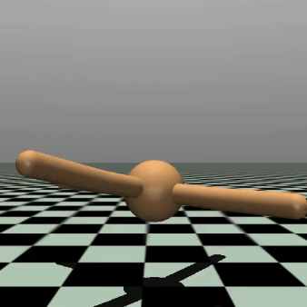

# Model-Based Reinforcement Learning with Neural Network Dynamics
This repository is an implementation of a model-based reinforcement learning agent based off of [1]. The agent uses off-policy training data in order to learn the system dynamics using a neural network. An MPC using a predictive sampling scheme is then used by the agent to determine the optimal action at each timestep within the environment. I've implemented training and evaluation on the Ant-v4 task.

    

## Citations
[1] Nagabandi, Anusha, et al. "Neural network dynamics for model-based deep reinforcement learning with model-free fine-tuning." 2018 IEEE international conference on robotics and automation (ICRA). IEEE, 2018.

[2] Anne, Timothée, Jack Wilkinson, and Zhibin Li. "Meta-learning for fast adaptive locomotion with uncertainties in environments and robot dynamics." 2021 IEEE/RSJ International Conference on Intelligent Robots and Systems (IROS). IEEE, 2021.

[3] Howell, Taylor, et al. "Predictive sampling: Real-time behaviour synthesis with mujoco." arXiv preprint arXiv:2212.00541 (2022).
